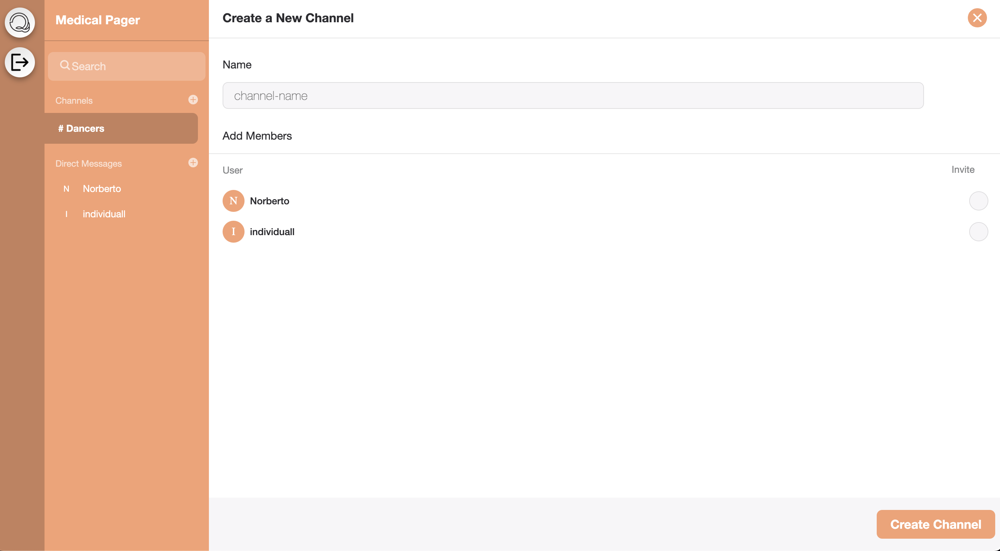

# Quaint Chat

URL: https://quaints.netlify.app/

Quaint Chat is a platform where people gather to chat, share ideas and just hang out. This is a Full-Stack Application where You will be able to add, edit and delete messages. THe user will be able to create new channels, react to messages and even reply to messages. The server side is deployed through Heroky and the frontend through Netlify. This is part of my Capstone project for General Assembly's Software Engineer Bootcamp.

## If cloned

Make sure to do 'npm install' within client and server folder and not in the root directory. 

## Technologies used 💾

- React
- Javascript
- HTML
- CSS
- GetStream.io
- Heroku
- Netlify

## Dependencies required 🔖

Install using 'npm install'

Install within CLIENT folder
- stream-chat
- stream-chat-react
- universal-cookies
- axios

Install within SERVER folder (run 'npm init -y' within this folder first before installing dependencies)

- bycrypt 
- crypto 
- dotenv 
- express 
- getstream 
- stream-chat 
- nodemon 
- cors

## Images 🌄

## Ice Box 🧊

- [ ] Delete Channels
- [ ] Create User Profile 
- [ ] Add SMS funtionality with Twilio
- [x] Improve CSS ]